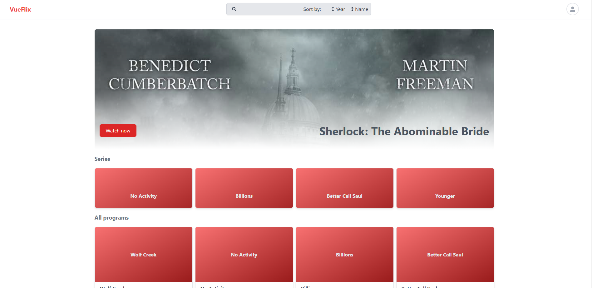
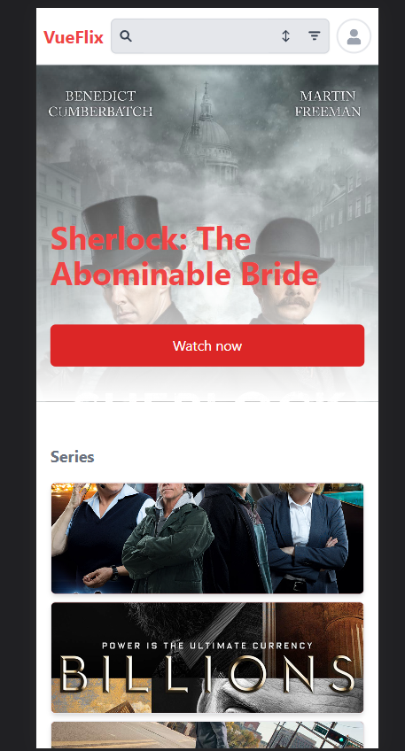

# Vueflix

A demo project using Vite.js, Vue 3, supabase and testing with vitest 
List programs (movies and series) from api and allow filter, sort and search

## Features
- [x] Filter programs by year and program type (series or movies)

- [x] Full text search with json-server

- [x] Sort by name and year

## Demo




## Prerequisites

| Prerequisite                                          | Version    |
| ------------------------------------------------------| ---------- |
| [Supabase Account](https://app.supabase.io/)          |    --      |
| [Node.js](http://nodejs.org)                          | `~ ^18.12.1` |
| npm (comes with Node) or yarn (used)                  | `~ ^8.19.2`|

## How to run it in your PC

### 1 Cloning the repo

```bash
  git clone https://github.com/jesusantguerrero/vueflix.git
```

Go to the project directory

```bash
  cd vueflix
```

Install dependencies

```bash
  npm install
```

### 2. Create a new supabase project
Sign up to Supabase - https://app.supabase.io and create a new project.

### 3. Get the URL and Key

Go to the Project Settings (the cog icon), open the API tab, and find your API URL and `anon` key, you'll need these in the next step.

The `anon` key is your client-side API key. It allows "anonymous access" to your database, until the user has logged in. Once they have logged in, the keys will switch to the user's own login token. This enables row level security for your data. Read more about this [below](#postgres-row-level-security).


**_NOTE_**: The `service_role` key has full access to your data, bypassing any security policies. These keys have to be kept secret and are meant to be used in server environments and never on a client or browser.


```bash
VITE_SUPABASE_URL=
VITE_SUPABASE_KEY=
VITE_API_URL=http://localhost:3000/entries
```


### Compile and Hot-Reload for Development

```sh
npm run dev
```

### Compile and Minify for Production

```sh
npm run build
```

### Run Unit Tests with [Vitest](https://vitest.dev/)

```sh
npm run test:unit
```

### Run End-to-End Tests with [Cypress](https://www.cypress.io/)

```sh
npm run test:e2e:dev
```

This runs the end-to-end tests against the Vite development server.
It is much faster than the production build.

But it's still recommended to test the production build with `test:e2e` before deploying (e.g. in CI environments):

```sh
npm run build
npm run test:e2e
```

### Lint with [ESLint](https://eslint.org/)

```sh
npm run lint
```

## Deploy 

[](https://app.netlify.com/start/deploy?repository=https://github.com/jesusantguerrero/vueflix)

Clicking this button will clone the repo to your GitHub account and instantly deploy to Netlify. You will need to have the [Netlify CLI](https://cli.netlify.com/) installed, and a `.env.local` file in 
## Recommended IDE Setup

[VSCode](https://code.visualstudio.com/) + [Volar](https://marketplace.visualstudio.com/items?itemName=Vue.volar) (and disable Vetur) + [TypeScript Vue Plugin (Volar)](https://marketplace.visualstudio.com/items?itemName=Vue.vscode-typescript-vue-plugin).

## Customize configuration

See [Vite Configuration Reference](https://vitejs.dev/config/).

